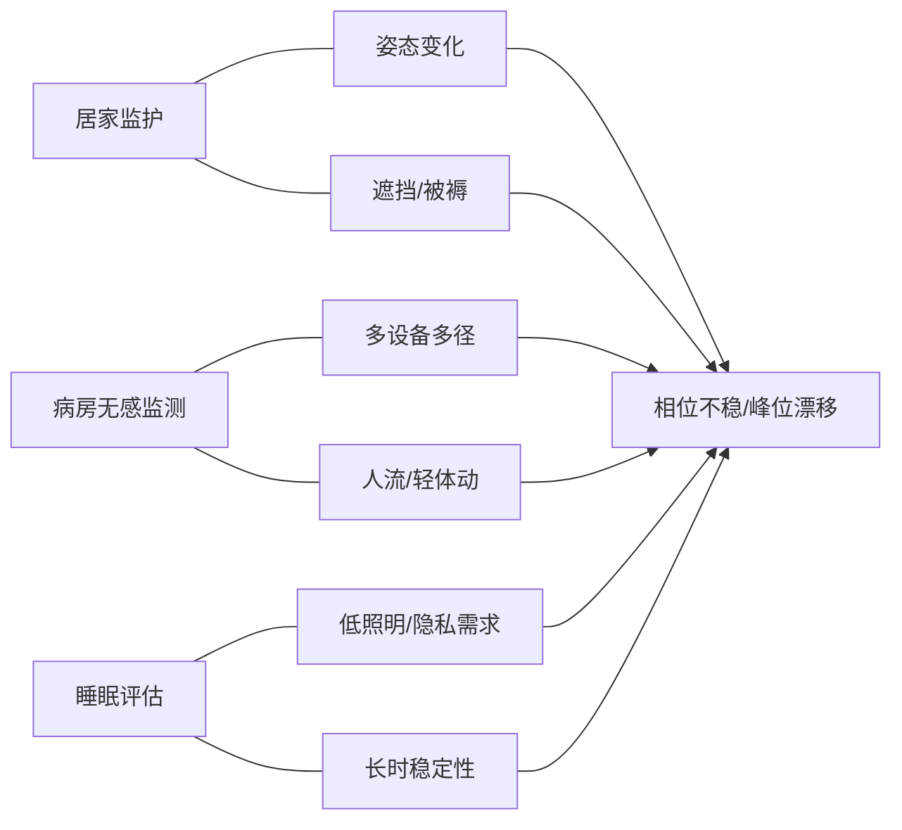

# 图1 应用场景与挑战（放在"一、研究背景与问题动机"末尾）

```mermaid
graph LR
S1[居家监护] --- C1[姿态变化]
S1 --- C2[遮挡/被褥]
S2[病房无感监测] --- C3[多设备多径]
S2 --- C4[人流/轻体动]
S3[睡眠评估] --- C5[低照明/隐私需求]
S3 --- C6[长时稳定性]
C1 --> P[相位不稳/峰位漂移]
C2 --> P
C3 --> P
C4 --> P
C5 --> P
C6 --> P
```

图注：典型应用场景与主要挑战之间的因果关联，挑战最终体现在相位不稳定与频谱峰漂移上。